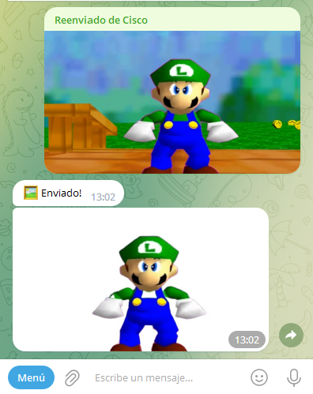
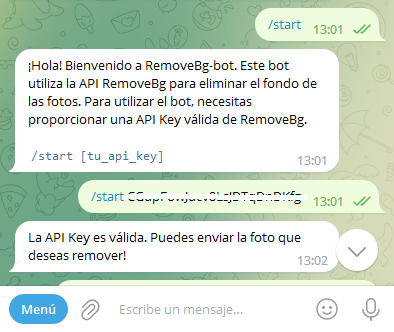
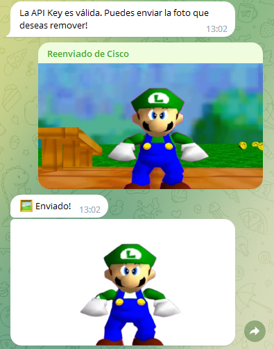

# RemoveBg-bot
RemoveBg-bot es un bot de Telegram que utiliza la API de Remove.bg eliminando automáticamente el fondo de la imagen y enviará la imagen resultante de vuelta al usuario.
RemoveBg-bot hace que sea fácil utilizar la API de Remove.bg sin la necesidad de escribir código, lo que lo hace accesible para una amplia gama de usuarios que buscan una solución rápida y fácil para remover fondos de fotos.

## Variables de Entorno
`token`: telegram bot token

## Ejecutar RemoveBg-bot
- Obtener el Api Key de [RemoveBg](https://www.remove.bg/r/ZcHBdWKSfKLRRbaMf2Kc1N5E)
- Clonar este repositorio `git clone https://github.com/fcoagz/RemoveBg-bot`
- Descarga las dependencias `pip install -r requirements.txt`
- Ejecute en el terminal `python main.py`
- 🖼 Disfrute!

## Api de RemoveBg
La API es capaz de identificar y separar el objeto principal de una imagen del fondo, lo que permite que el objeto sea utilizado en un contexto diferente.

La API de Remove.bg ofrece varios planes. El plan gratuito de Remove.bg permite remover el fondo de hasta 50 imágenes por mes con un tamaño máximo de 0.25 megapíxeles (625x400 píxeles).

## Captura de Pantalla

